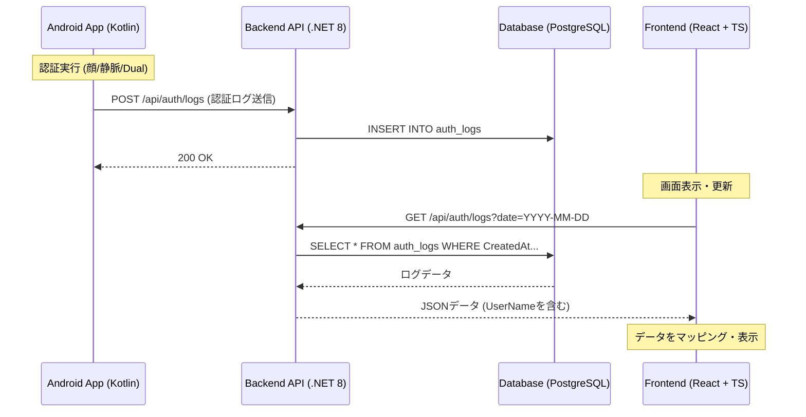

# 認証履歴 (AuthHistory) 画面：技術設計ドキュメント

## 1. システム概要
本ドキュメントは、Android端末（BodyCamera/Shonin）で発生した認証ログをサーバーに集約し、管理画面（Frontend）で閲覧・管理する「認証履歴」機能の技術詳細をまとめたものです。

### 主な機能
- **Android**: 認証結果（成功・失敗・エラー理由・ユーザー名等）を即座にAPI経由で送信。
- **Backend (API)**: ログの記録（PostgreSQL）と、日付フィルタリングを含む取得機能。
- **Frontend**: 履歴の表表示、詳細情報のモーダル表示、CSVエクスポート、検索・フィルタ機能。

---

## 2. システムアーキテクチャ・フロー
認証発生から表示までの全体シーケンスを以下に示します。

---

## 3. API 仕様書 (AuthLog API)

### 3.1. 認証ログの登録
Androidアプリから認証結果を送信する際に使用します。

- **Endpoint**: `POST /api/auth/logs`
- **Request Body (JSON)**:
| フィールド | 型 | 必須 | 説明 |
| :--- | :--- | :---: | :--- |
| `serialNo` | String | ○ | デバイス識別番号 |
| `userId` | String | ○ | インデックスされたユーザーID |
| `userName` | String | - | ユーザーの氏名（顔認証時のメタデータ等） |
| `authMode` | Integer | ○ | 0:顔, 1:静脈, 2:顔＋静脈 |
| `isSuccess` | Boolean | ○ | 認証成否 |
| `errorMessage` | String | - | 失敗時のエラー内容やモード情報 |
| `timestamp` | DateTime | - | 端末側の発生時刻（空の場合はサーバー時刻を使用） |

### 3.2. 認証ログの取得
管理画面で履歴を表示する際に使用します。

- **Endpoint**: `GET /api/auth/logs`
- **Query Parameter**:
  - `date`: (任意) `YYYY-MM-DD` 形式。指定された日のログのみを返却。
- **Response**: `AuthLog` オブジェクトの配列（新しい順）。

---

## 4. 各層の実装詳細

### 4.1. Android 側実装
Android側では認証完了後のActivityで非同期にAPIを呼び出します。

- **主要ファイル**:
  - `VeinResultActivity.kt`: 認証結果を表示し、`uploadAuthLog()` を呼び出してAPI送信を開始する。
  - `DeviceApiClient.kt`: OkHttpClient を使用して API と直接通信するラッパー。
- **主要関数**:
  - `uploadAuthLog()`: UI上のデータ（結果、ID、名前）を収集し、API用のリクエストを作成。
  - `sendAuthLog()`: OkHttpの `enqueue` を使用してバックグラウンドで非同期送信を実行。

### 4.2. Backend (API) 側実装
マルチテナント対応とタイムゾーン処理が核心部分です。

- **主要ファイル**:
  - `AuthLogController.cs`: エンドポイントの定義とテナントDBの動的接続。
  - `AuthLog.cs`: データベースのテーブルモデル。
- **重要なロジック**:
  - **タイムゾーン処理**: フロントから送られた日付（JST）を `DateTime.SpecifyKind(..., DateTimeKind.Local)` で処理し、PostgreSQLのUTCと整合性を取るために `ToUniversalTime()` へ変換してクエリを実行します。
  - **UserName の保存**: 顔認証等で取得した `UserName` を確実にDBに保存し、取得時に提供します。

### 4.3. Frontend (React) 側実装
取得したデータをユーザーフレンドリーな形式に整形して表示します。

- **主要ファイル**:
  - `apiClient.ts`: APIレスポンスを TypeScript の型 (`AuthLog`) にマッピング。
  - `AuthHistory.tsx`: メインのUI画面。
- **マッピング処理**:
  - APIからのレスポンスオブジェクトに `userName` フィールドを追加してマッピングし、表内の「User Name」カラムに表示。
  - **検索機能**: User ID だけでなく User Name によっても履歴をフィルタリング可能。

---

## 5. データベース構成 (auth_logs)

| カラム名 | 型 | 説明 |
| :--- | :--- | :--- |
| `Id` | SERIAL | プライマリキー |
| `SerialNo` | TEXT | デバイスシリアル |
| `UserId` | TEXT | ユーザー識別ID |
| `UserName` | TEXT | ユーザー氏名 (NULL可) |
| `AuthMode` | INTEGER | 認証モード (0,1,2) |
| `IsSuccess` | BOOLEAN | 成否 |
| `ErrorMessage` | TEXT | エラー詳細 |
| `CreatedAt` | TIMESTAMP | ログ生成日時 (UTC) |

---

