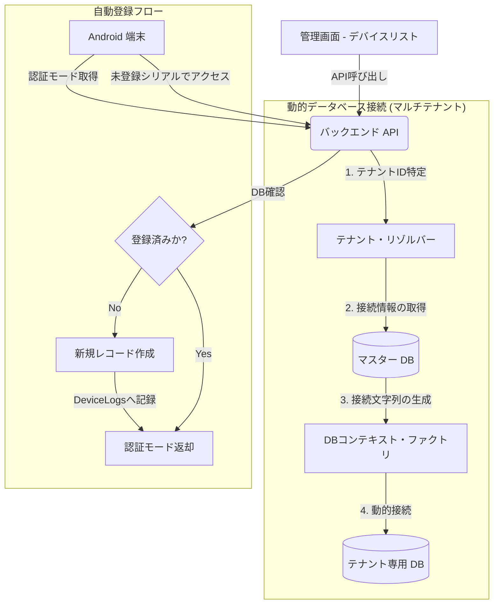

# デバイス管理 (Device Management) 画面：技術設計ドキュメント

## 1. システム概要
本ドキュメントは、システムに登録されている認証デバイス（Android端末等）を管理するための「デバイスリスト」および関連機能の技術詳細をまとめたものです。管理者はこの画面を通じて、デバイスの登録、設定変更（認証モードの切り替え）、有効化/無効化、および削除を行うことができます。

### 主な機能
- **デバイス一覧表示**: 登録済みデバイス（シリアル番号、名称、現在の認証モード、状態）のリアルタイム表示。
- **デバイス登録/更新**: 新規デバイスの手動登録、および既存デバイスの設定変更（UI/API両方から可能）。
- **認証モード配信**: デバイス側（Android）からの問い合わせに対し、設定された認証モードを返却。
- **自動登録機能**: 未登録のデバイスがAPIにアクセスした際、自動的に「Unknown」として登録するフォールバック機能。
- **変更履歴参照**: デバイスごとの設定変更履歴（作成、更新、削除等）の追跡。

---

## 2. システムアーキテクチャ・フロー
デバイスのライフサイクルと管理フローを以下に示します。

### DB接続の補足
本システムは**マルチテナント方式**を採用しており、`Dapper / EF Core` は直接特定のDBに固定されているわけではありません。
1. APIがリクエスト（Header/Cookie）から `contractClientCd` を判別。
2. マスターDBからその依頼主専用の接続先情報を取得。
3. `ContractClientDbContextFactory` が実行時に動的にDB接続を確立します。

---

## 3. API 仕様書 (Device API)

### 3.1. デバイス一覧の取得
- **Endpoint**: `GET /api/device`
- **Response**: `Device` オブジェクトの配列。
  - `DelFlg = false`（未削除）のデータのみが返却されます。

### 3.2. デバイスの作成/更新
- **新規登録 (POST)**: `POST /api/device`
- **一括更新 (PUT)**: `PUT /api/device/{serialNo}`
- **Request Body**:
| フィールド | 型 | 説明 |
| :--- | :--- | :--- |
| `serialNo` | String | デバイスのシリアル番号 (ユニークキー) |
| `deviceName` | String | デバイス表示名 |
| `authMode` | Integer | 0:顔, 1:静脈, 2:顔＋静脈 |
| `isActive` | Boolean | 有効状態 (falseの場合はAndroid側で認証不可) |

### 3.3. 認証モードの取得 (for Android)
端末が自身の設定を取得するために使用します。
- **Endpoint**: `POST /api/device/getAuthMode`
- **Logic**:
  - シリアル番号がDBにない場合、自動的に新規登録を行います。
  - `isActive = false` の場合、`403 Forbidden` を返却し、端末側の動作を制限します。

---

## 4. 各層の実装詳細

### 4.1. Backend (API) 側実装
- **主要ファイル**:
  - `DeviceController.cs`: デバイス管理の全ロジック（CRUDおよび自動登録）を実装。
  - `Device.cs`: デバイス情報のテーブル定義。
  - `DeviceLog.cs`: 変更履歴を保存するためのモデル。
- **重要なロジック**:
  - **テナント分離**: `GetContractClientDb()` メソッドにより、ヘッダーやCookieからテナントコードを識別し、接続先のDBを動的に切り替えます。
  - **履歴記録**: デバイスを作成・更新・削除するたびに、`device_logs` テーブルへそのアクション（例：「デバイスを削除」）と時刻を記録します。

### 4.2. Android 側実装
Android 端末側では、起動時に自身のシリアル番号を取得し、サーバーから最新の「認証モード」を取得して動作を決定します。

- **主要ファイル**:
  - `TopActivity.kt`: アプリの起動画面。シリアル取得からモード反映までのメインフローを制御。
  - `DeviceSerialHelper.kt`: 端末固有のシリアル番号を取得するためのユーティリティ。
  - `DeviceApiClient.kt`: サーバーAPI (`/getAuthMode`) と通信し、設定値をパースするクラス。
- **実装されている主要な処理**:
  1. **シリアル番号の取得 (`DeviceSerialHelper.getDeviceSerial`)**: 
     - ベンダー独自のシリアル (`vendor.gsm.serial`) や Android 標準のシリアル (`ro.serialno`) を優先順位に従って走査します。
     - 全て取得できない場合はフォールバックとして `ANDROID_ID` を使用し、常に一意の ID を確保します。
  2. **認証モードの自動取得と適用 (`TopActivity.onCreate`)**:
     - `DeviceApiClient.getAuthMode` を呼び出し、サーバーにシリアル番号を送信します。
     - サーバーから返却された `authMode` (0:顔, 1:静脈, 2:複合) に応じて、自動的に適切な認証フロー (`startAuthFlowByMode`) を開始します。
     - 未登録デバイスの場合はサーバー側で自動登録され、管理画面に「Unknown」として表示されます。
  3. **アクセス制御のハンドリング**:
     - 管理画面でデバイスが「無効」に設定されている場合、API は `403 Forbidden` を返します。
     - アプリ側では「このデバイスは無効化されています」というメッセージを表示し、認証フローへの遷移を遮断します。

### 4.3. Frontend (React) 側実装
- **主要コンポーネント**:
  - `DeviceList.tsx`: 一覧表示および検索、削除アクションのトリガー。
  - `DeviceEdit.tsx`: 新規登録および編集用フォーム。
  - `DeviceLogs.tsx`: 個別デバイスの変更履歴を表示するサブ画面。
- **特徴**:
  - **リアルタイム反映**: 更新成功後、一覧データを再取得することで最新の状態を維持します。
  - **ステータス表示**: 有効/無効の状態を色分けされたバッジで視認性高く表示します。

---

## 5. データベース構成 (devices)

| カラム名 | 型 | 説明 |
| :--- | :--- | :--- |
| `Id` | SERIAL | プライマリキー |
| `SerialNo` | TEXT | 一意のシリアル番号 (INDEX) |
| `DeviceName` | TEXT | デバイス名（設置場所等） |
| `AuthMode` | INTEGER | 0:顔, 1:静脈, 2:顔＋静脈 |
| `IsActive` | BOOLEAN | 通信許可フラグ |
| `DelFlg` | BOOLEAN | 論理削除フラグ |
| `CreatedAt` | TIMESTAMP | 作成日時 |
| `UpdatedAt` | TIMESTAMP | 最終更新日時 |

---

## 6. 特筆事項
- **セキュリティ**: 有効フラグ (`IsActive`) を `false` に設定することで、シリアル番号を削除することなく、即座に特定の端末からの利用を遮断できます。
- **トレーサビリティ**: `DeviceLog` を通じて、「いつ」「どのデバイスが」「どのモードに変更されたか」を後から追跡可能です。
