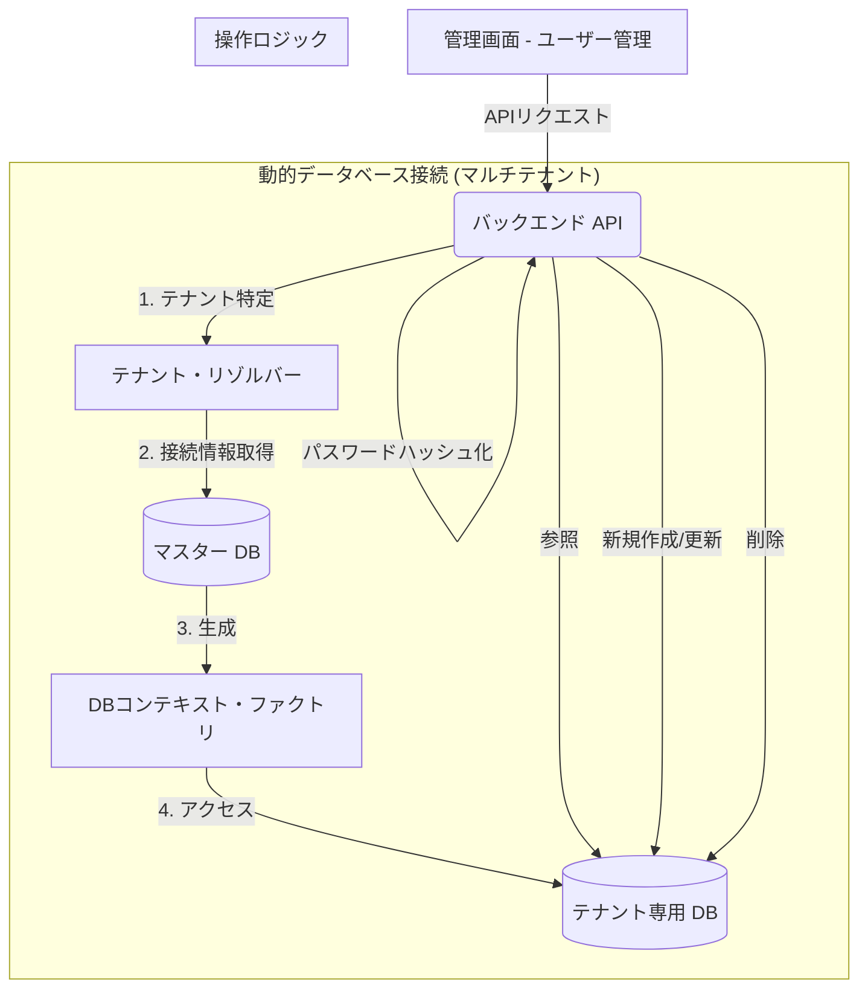

# ユーザー管理 (User Management) 画面：技術設計ドキュメント

## 1. システム概要
本ドキュメントは、管理システムの利用者を管理するための「ユーザー管理」機能の技術詳細をまとめたものです。主に、システムにログインして各種設定や履歴確認を行う「管理者（Admin User）」のアカウント管理（作成、更新、削除）を目的としています。

### 主な機能
- **管理者一覧表示**: システムに登録されている全ての管理者アカウントのリスト表示。
- **新規アカウント作成**: 新しい管理者の登録（ユーザー名、パスワード、ロールの指定）。
- **アカウント情報の更新**: 各管理者のロール（権限）の変更、およびパスワードの再設定。
- **アカウント削除**: 不要になった管理者の削除（※デフォルトの `admin` ユーザーは保護対象）。
- **権限管理**: `super_admin`（全権限）と `admin`（一般権限）の2種類のロールによる制御。

---

## 2. システムアーキテクチャ・フロー
アカウント管理の基本的なデータフローを示します。

---

## 3. API 仕様書 (AdminUsers API)

### 3.1. ユーザー一覧の取得
- **Endpoint**: `GET /api/AdminUsers`
- **Response**: `AdminUser` オブジェクトの配列（パスワードハッシュは除外）。

### 3.2. ユーザーの新規登録
- **Endpoint**: `POST /api/AdminUsers`
- **Request Body**:
| フィールド | 型 | 必須 | 説明 |
| :--- | :--- | :---: | :--- |
| `username` | String | ○ | ログインIDとなるユーザー名 |
| `password` | String | ○ | 平文パスワード（API側でハッシュ化） |
| `role` | String | ○ | `super_admin` または `admin` |

### 3.3. ユーザー情報の更新
- **Endpoint**: `PUT /api/AdminUsers/{id}`
- **説明**: 特定のユーザーのパスワードや権限を変更します。

### 3.4. ユーザーの削除
- **Endpoint**: `DELETE /api/AdminUsers/{id}`
- **制約**: 初期管理ユーザー（`admin`）は、システム保護のため削除できないように実装されています。

---

## 4. 各層の実装詳細

### 4.1. Backend (API) 側実装
- **主要ファイル**:
  - `AdminUsersController.cs`: ユーザー管理のCRUDロジックを実装。
  - `AdminUser.cs`: データベースのテーブル定義。
- **セキュリティ・ロジック**:
  - **パスワードハッシュ化**: `ComputeSha256Hash` メソッドにより、パスワードを `SHA256` アルゴリズムでハッシュ化して保存します。平文での保存は一切行われません。
  - **重要ユーザーの保護**: 修正・削除リクエストの際、対象がデフォルトの `admin` アカウントであるかをチェックし、必須アカウントが消失しないよう制御しています。
  - **マルチテナント切替**: 他のコントローラー同様、`GetContractClientDb()` によりアクセス元の企業ごとにデータベースを動的に切り替えます。

### 4.2. Frontend (React) 側実装
- **主要コンポーネント**:
  - `UserList.tsx`: ユーザー一覧の表示、新規登録・編集ダイアログの制御。
- **特徴**:
  - **状態管理**: ユーザーデータの取得、追加、更新後のリスト再描画を効率的に行います。
  - **ロールの色分け**: 管理者の権限（ロール）に応じて表示ラベルの色を変えるなど、一目で権限が分かるUIになっています。

---

## 5. データベース構成 (admin_users)

| カラム名 | 型 | 説明 |
| :--- | :--- | :--- |
| `id` | SERIAL | プライマリキー |
| `username` | TEXT | ユーザー名（ユニーク） |
| `password_hash` | TEXT | SHA256でハッシュ化されたパスワード |
| `role` | TEXT | 権限ロール (`super_admin`, `admin`) |
| `created_at` | TIMESTAMP | アカウント作成日時 |

---

## 6. 特筆事項
- **セキュリティ方針**: パスワードのハッシュ化にはソルトの追加や、より強固なアルゴリズム（BCrypt等）への将来的な移行も検討可能な設計となっています。
- **アクセスコントロール**: 本画面へのアクセス自体に `super_admin` 権限を要求するなどの上位レイヤーでのガード rails の実装を前提としています。
